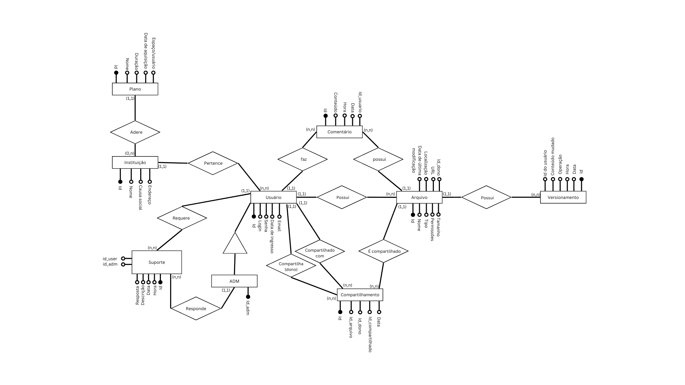

# Projeto_DB

**Projeto para a disciplina de Projeto de Banco de Dados - UNICAP, 2024.2**

**Professor:** Jheymesson Apolinario

**Alunos:** 
- Maria Luiza Ribeiro de Lima (**RA:** 00000848982)
- Matheus Veríssimo Rodrigues Pinheiro (**RA:** 00000850062)
- Roberto Regis de Araújo Lima Neto (**RA:** 00000848959)
- Vinícius Martins Galindo Andrade (**RA:** 00000848753)
- Vitor Hugo José Sales da Silva (**RA:** 00000849201)

# Parte 1

  

    
1- Modelo conceitual

    
  

  

    
2- Modelo lógico

     
  

  

    
3- Modelo físico

    <ul>
      <li> a- Criação da base de dados </li>
      <li> b- Inserir objeto </li>
      <li> c- Buscar </li>
      <li> d- Atualizar </li>
      <li> e- Remover </li>
    </ul>

  

  # Parte 2

